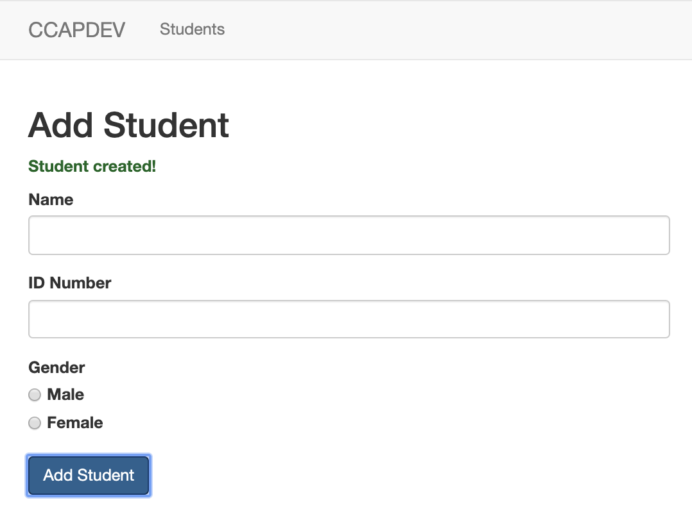
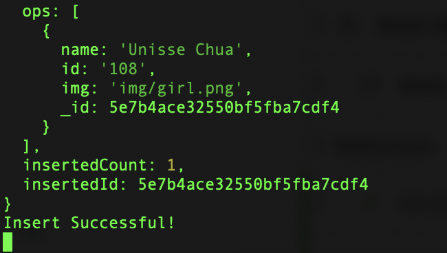
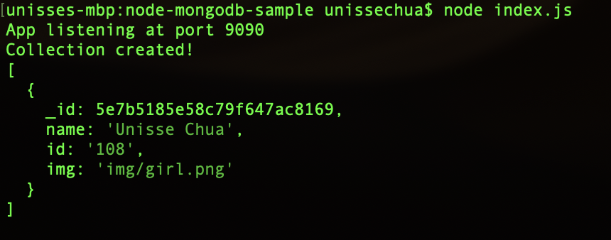
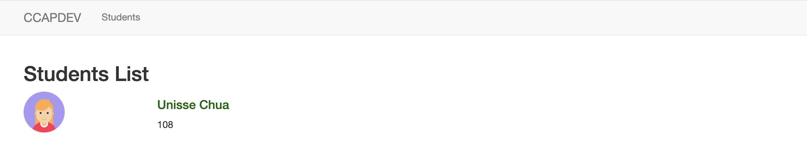
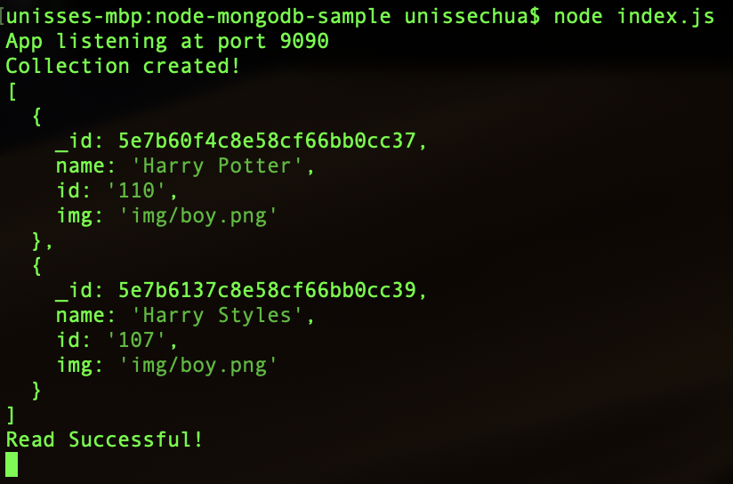
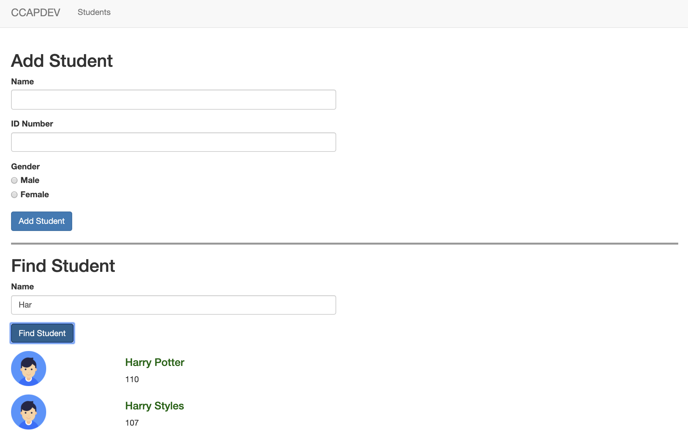
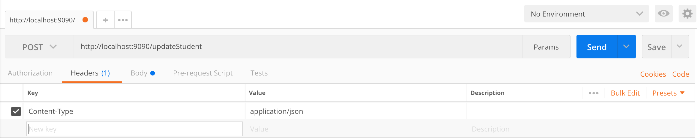
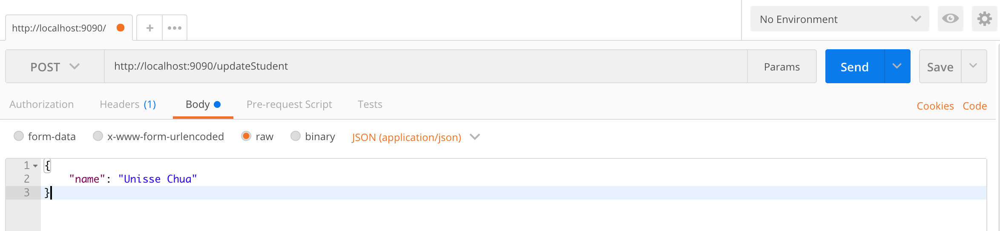
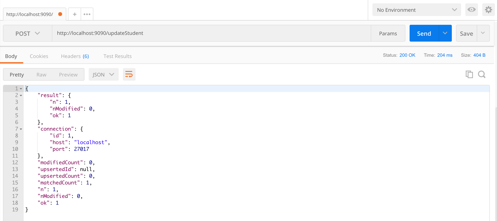

# Instructions
Follow these step by step instructions to be able to connect the provided client-side code with the database.

## Familiarize yourself with the code.
There's no needed modifications for any of the views or [`js/script.js`](public/js/script.js). All instructions listed below should work without any modifications made to the other files except **`index.js`**.

Important files to look through are:
#### [`js/script.js`](public/js/script.js)
Take note of the AJAX post call to `addStudent` and `searchStudents`. These are all attached to button clicks.
#### [`views/home.hbs`](views/home.hbs)
Connected to the `script.js` file, take notice of the `id` of the HTML elements for selection using jQuery.
#### [`views/students.hbs`](views/students.hbs)
This file is back to the handlebars template and no longer an empty `<div>` tag. I kept it this way to show the two possible ways of passing data from the server to the client.

In this method, the data is loaded **by the server** through the handlebars view engine. It's **NOT** loaded by the client through AJAX.

#### [`index.js`](index.js)
Read through the inline comments for each section and take note of the TODO comments. The database URL definition are already provided with the `dbname`.

We need to pass the `useUnifiedTopology` option whenever we connect to the database because of [this update in 3.2.1](https://github.com/mongodb/node-mongodb-native/releases/tag/v3.2.1).
```JavaScript
// additional connection options
const options = { useUnifiedTopology: true };
```

## Connecting to the database
1. Open up `index.js`.
2. Notice that there's already a connection made to the database:
  ```JavaScript
  /**
    First connection to the database once the application starts.
    This is so that we can create the collections needed prior to any transactions
    that we need to do.
  **/
  mongoClient.connect(databaseURL, options, function(err, client) {
    /**
      Only do database manipulation inside of the connection
      When a connection is made, it will try to make the database
      automatically. The collection(like a table) needs to be made.
    **/
    if (err) throw err;
    const dbo = client.db(dbname);

    //Will create a collection if it has not yet been made
    dbo.createCollection("students", function(err, res) {
      if (err) throw err;
      console.log("Collection created!");
      client.close();
    });
  });
  ```

  When we connect to the database and we provide a database name that's not yet created, it will create it for you.

  We also created a collection named `students` to hold all our student documents. Even if you restart your server later on, there should be no problem with this code since it will only create the collection if it does not exist.

## Add Student
1. Open `public/js/script.js`.
2. The code here is still very similar to the previous AJAX exercise. A minor change is in the `POST` callback.
  ```JavaScript
  $.post('addStudent', newStudent, function(data, status) {
    console.log(data);

    if (data.success) {
      $('#msg').text(data.message);
      $('#msg').addClass('success');

      $('#name').val('');
      $('#idnum').val('');
      $("input[name='gender']:checked").prop("checked", false);
    } else {
      $('#msg').text(data.message);
      $('#msg').addClass('fail');
    }

  });
  ```

  Notice here that we don't get the new student data from the server anymore. Instead, we're supposed to expect `data.success` and `data.message`. Based on the validations and usage, we can deduce that `success` is `boolean` and `message` is a `String`.

  This should be what the response object looks like:
  ```JavaScript
  {
    success: true,
    message: "Some message from the server"
  }
  ```

  Based on this, let's now work on writing the backend API.
3. Open `index.js`. Look for the `addStudent` post method.
4. In the callback, we already have an object/document ready for insert. This is still the same format as the AJAX sample.
  ```JavaScript
  const student = {
    name: req.body.name,
    id: req.body.id,
    img: `img/${req.body.gender}.png`
  };
  ```
5. To add the new object to the database, we need to first make a connection.
  ```JavaScript
  mongoClient.connect(databaseURL, options, function(err, client) {
    if(err) throw err;
    // Connect to the same database
    const dbo = client.db(dbname);

    // More stuff to go here ...
  });
  ```
6. Once connected, inside the callback, we insert the object student to the collection `"students"`. Make sure to place this **inside the callback**.
  ```JavaScript
  dbo.collection("students").insertOne(student, function(err, res) {
    if (err) throw err;

    console.log(res);
    console.log("Insert Successful!");

    client.close();
  });
  ```
  What this does is inserts the student object and logs in the server console `"Insert Successful!"`.
7. Now, remember from `script.js` the backend is supposed to send an object that has `success` and `message`. Let's create that response outside the callback functions.
  ```JavaScript
  mongoClient.connect(databaseURL, options, function(err, client) {
    // Insert here.. Done!
  });

  // New code to be added
  const result = { success: true, message: "Student created!" };
  res.send(result);
  ```

  We created the custom response object and we sent that object through the response: `res`.

8. Restart the server and test it out by adding a student through the form. Once you click the Add Student button, the message should be displayed above the form.
  

  And in addition, there should be some logs in the command line:
  

  Notice that it automatically adds an `_id`to the document!

Congratulations! You've successfully inserted user input data into the database! 👏🏻

## View students
We now have 1 student inserted into the database! Feel free to add some more if you'd like before you proceed with the **R**EAD part of the database.

1. Open `views/students.hbs`. We have the template for looping through a `students` object. If there's none, we simply display "No students yet". But we have one already. We need to fix the routing parameters!
  ```HTML
  <h2>Students List</h2>
  {{#if students}}
    <!-- Looping through lists -->
    {{#each students}}
      <div class="row student">
        <div class="col-sm-2 center">
          
        </div>
        <div class="col-sm-10">
          <h4>{{this.name}}</h4>
          <p>{{this.id}}</p>
        </div>
      </div>
    {{/each}}
  {{else}}
    <p>No students yet</p>
  {{/if}}
  ```

2. Open `index.js`. Find the route for `/students`.
  ```JavaScript
  // Students route
  app.get('/students', function(req, res) {
    // TODO: Retrieve data from database and send data with template
    res.render('students', { title: 'Students' });
  })
  ```

  Currently, there's no `students` field in the object. Just the title.

3. To be able to get the students from the database, we need to first establish a connection. Add this code before the `res.render(...)` line.
  ```JavaScript
  mongoClient.connect(databaseURL, options, function(err, client) {
    if(err) throw err;
    // Connect to the same database
    const dbo = client.db(dbname);

    // More stuff to go here ...
  });
  ```
4. We learned from the lecture, to get data we need to use the method `find()`. Since we're getting **all** the students, we don't need any special query filter, just an empty object `{}`. Add this inside the `connect()` callback.
  ```JavaScript
  dbo.collection("students").find({}).toArray(function(err, result) {
    if(err) throw err;

    console.log(result); // To be replaced later...
    console.log("Read Successful!");
    client.close();
  });
  ```

  Pause. Save and restart the server. Navigate to [http://localhost:9090/students](http://localhost:9090/students). Don't worry, nothing is supposed to happen _yet_ on the client side. But check your command line. It should have something!

  

5. We can see now what the data looks like, so let's throw it back to the client! Remove the `console.log(result)` to clean up the code a little. After the `client.close()` line, add this:

  ```JavaScript
  // Return the result with the template render!
  res.render('students', {
    title: 'Students',
    students: result,
  });
  ```

  Also comment out the original `res.render('students', { title: 'Students' });`.

  With this, what we're doing is sending the database response with the template render. Save and restart the server. Refresh the [http://localhost:9090/students](http://localhost:9090/students) page. It should now show the student you added!

  

Congratulations! You've successfully retrieved data from the database! 😉 Notice that even if you restart your server, the data is still there? It's because the data is no longer hardcoded in the node.js express server but on the MongoDB server!


## Find student(s)
The last task for this exercise is to expand the find example a bit and use a form to query the database. This will utilize the previous AJAX lesson in displaying the data immediately (without a page refresh)!

1. Open `js/script.js` and find the click event for `#findStudent`.
  ```JavaScript
  // #findStudent POST call
  $('#findStudent').click(function() {
    // Get the data from the form
    var name = $('#searchName').val();

    $.post('searchStudents', { name: name }, function(data, status) {
      console.log(data);

      var studentListContainer = $('#studentList');
      studentListContainer.empty(); // clear children every time (refresh results)

      data.forEach((item, i) => {
        addStudentDiv(item, studentListContainer);
      });

    });
  });
  ```
  Here we get the data from the `#searchName` field and make a `POST` request to `searchStudents`. The request is simple, we just send the name.

  After, the client handles the response by iterating through each item and manipulating the DOM by adding it on the fly. (This is using our previous function from AJAX!)

2. Let's make the API endpoint for the `searchStudents` POST call. Open `index.js` and look for the last TODO item.
  ```JavaScript
  app.post('/searchStudents', function(req, res) {
    var query = {
      name: { $regex: '^' + req.body.name }
      // name: { $regex: `^${req.body.name}` }
    };

    // Database stuff goes here!
  });
  ```

  What we have so far is the query filter object. Our database also has a `name` field, but the value is not directly the data from the request...

  We'll do a `LIKE` query here instead of an `=` query using the [`$regex`](https://docs.mongodb.com/manual/reference/operator/query/regex/#op._S_regex) query operator. Using the string format here so we can concatenate with the object variable.

3. Again, we connect to the database...
  ```JavaScript
  mongoClient.connect(databaseURL, options, function(err, client) {
    if(err) throw err;
    // Connect to the same database
    const dbo = client.db(dbname);

    // More stuff to go here ...
  });
  ```

4. Then we do the `find()` but this time, we're passing a query object!

  ```JavaScript
  dbo.collection("students").find(query).toArray(function(err, result) {
    if(err) throw err;

    console.log(result);
    console.log("Read Successful!");
    client.close();

    // send result here

  });
  ```

5. Save and restart the server. Enter the first three letters of a student you added and click "Find Student". Nothing will show on the client yet, but let's check the console log in the command line first.
  

6. We can send the result directly now because the client is expecting an array for the data. Add `res.send(result);` to the callback from above. Restart the server and refresh. You should now see the students listed below the form.
  

Congratulations! You've now completed this mini tutorial. For updating a value in the database, there's a POST method in `index.js`. You can test it out using [Postman](https://www.postman.com/) while the server is still running.

Here's how to configure it once you've downloaded Postman.
1. Make sure the method is POST. Then set the headers to:


2. Then set your request body. It has to be in JSON format so all fields and values are using double quotes. The endpoint is programmed for an exact match, so make sure the value is a match to a record you have.


3. The result should look something like this:


4. Go back to your View Students and see if the ID Number was updated to `120`. 
